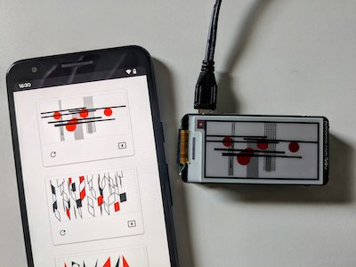
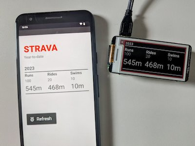

# eInk mini display

Art on a 250x122px Inky pHAT display.

[Getting Started with Inky pHAT](https://learn.pimoroni.com/article/getting-started-with-inky-phat)



Plus Strava YTD stats at `/strava`.



## Running

Site is a standard Python Flask app. Displaying images on the Inky pHAT display is feature flagged to work when running on a Raspberry Pi.

Strava props.py required at the root:

```txt
client_id=
client_secret=
athlete_id=
```

Run the Flask app:

```bash
flask --app app run -h <pi-ip-address>
```
